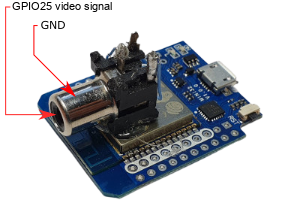

# Introduction
*ESP32 Composite Video Library* is a library that provides functions to generate
composite video signal without any external hardware on ESP32 chips.

For now, color is not supported.

## Features

* No external components required
* Supports **PAL**, **SECAM** and **NTSC**
* Multiple resolutions
* 6 pixel clocks:
  * 14.75 MHz and 7.357 MHz – PAL square pixels
  * 12.273 MHz and 8.136 MHz – NTSC square pixels
  * 13.5 MHz and 6.75 MHz – PAL and NTSC BT.601 DV/DVD formats
* Different framebuffer formats:
  * RGB565
  * RGB332
  * Grey 8 bits/pixel
  * Grey 4 bits/pixel
  * Monochrome 1 bit/pixel
  * LVGL monochrome 1 byte/pixel

* Supports [LVGL](https://lvgl.io) graphics library

## Applications

* infotainment systems
* emulators
* 8 bit style game consoles
* video diagnostic

## License

This program is free software: you can redistribute it and/or modify
it under the terms of the GNU General Public License as published by
the Free Software Foundation, either version 3 of the License, or
(at your option) any later version.

# Requirements

The library should work on any ESP32 board with Tensilica core and free GPIO25 pin. The test environment was as follows:

| Name | Value  |
|------|--------|
|Chip  |ESP32   |
|Cores |2       |
|RAM   |520 KiB |
|FLASH |4 MiB   |
|Clock |240 MHz |

No external elements are required. Composite signal is generated on **GPIO25** pin, and it can be directly connected to composite input.

It requires ESP32-IDF development environment. Version 4.4 was used.

>:information_source: Compiler optimization level must be set to **performance** (`-O2`).

# Composite video

Composite video is an analog video signal. It was commonly used before the digital era.

There are three variants of composite video: NTSC, PAL, and SECAM. NTSC generates 30 frames per second using 525 lines. PAL and SECAM generates 25 frames per seconds in 625 lines.

## Connection

Connect **GPIO25** to composite video input and board **GND** to input GND.

If you use a CINCH (RCA) cable, the video signal goes to the pin in the middle, and GND to the outside metal part.



## Modes

The library can generate any resolution in non-interlaced mode.

Here is a list of predefined commonly used resolutions:

| Resolution | System    | Pixel clock | Description                         |
|------------|-----------|-------------|-------------------------------------|
| 384×288    | PAL/SECAM | 7.357 MHz   | Overscan non-interlaced             |
| 320×256    | PAL/SECAM | 7.357 MHz   | Amiga PAL low res non-interlaced    |
| 320×200    | PAL/SECAM | 7.357 MHz   | Commodore 64 hi res mode            |
| 320×192    | PAL/SECAM | 7.357 MHz   | Atari 8 bit "Graphics 8"            |
| 256×192    | PAL/SECAM | 7.357 MHz   | ZX Spectrum, MSX                    |
| 640×200    | PAL/SECAM | 14.75 MHz   | Amstrad CPC hi res                  |
| 640×256    | PAL/SECAM | 14.75 MHz   | Amiga PAL hi res non-interlaced     |
| 512×192    | PAL/SECAM | 14.75 MHz   | Timex, Sinclair QL, MSX2            |
| 768×288    | PAL/SECAM | 7.357 MHz   | Overscan hi res non-interlaced      |
| 360×288    | PAL/SECAM | 6.75 MHz    | BT.601 DV/DVD non-interlaced        |
| 720×288    | PAL/SECAM | 13.5 MHz    | BT.601 DV/DVD hi res non-interlaced |
| 256×192    | NTSC      | 6.136 MHz   | ZX Spectrum, MSX                    |
| 320×192    | NTSC      | 6.136 MHz   | Atari 8 bit "Graphics 8"            |
| 320×200    | NTSC      | 6.136 MHz   | Commodore 64 hi res mode            |
| 640×200    | NTSC      | 13.5 MHz    | Amiga NTSC hi res non-interlaced    |
| 320×240    | NTSC      | 6.136 MHz   | NTSC Overscan square pixels         |
| 640×240    | NTSC      | 13.5 MHz    | NTSC Overscan, non-interlaced       |
| 360×240    | NTSC      | 13.5 MHz    | BT.601 DV/DVD hi-res non-interlaced |
| 720×240    | NTSC      | 13.5 MHz    | BT.601 DV/DVD hi-res non-interlaced |

# How to use

Add the library as a new component to your project.

```bash
git submodule add https://github.com/aquaticus/esp32_composite_video_lib.git components/esp32_composite_video_lib
```
The above command will clone the library into the `components` directory.

You can optionally launch the configuration menu with `idf.py menuconfig` on your project root directory. Go to Component config and then `Composite Video Configuration`.

To use LVGL library along composite video library add one more submodule:

```bash
git submodule add https://github.com/lvgl/lvgl.git components/lvgl
```

# Sample program

To see something on your screen, create the simplest program.

```C
#include "video.h"

void app_main(void)
{
    video_test_pal(VIDEO_TEST_PM5544);
}
```
The above program will display Philips PM5544 pattern in PAL 384x288 resolution. For NTSC, replace function to `video_test_ntsc()`.

## Demo

Demo program is available on separate repository: https://github.com/aquaticus/esp32_composite_video_demo

Clone the repository:

```bash
git clone --recurse-submodules https://github.com/aquaticus/esp32_composite_video_demo
```
Build

```bash
cd esp32_composite_video_demo
idf.py build
```

and upload to the board

```bash
idf.py flash
```
# API

The library provides functions to setup image generation but not functions to draw lines or other graphics primitives.

To create graphical elements and visual effects, see the next chapter about integration with LVGL library.

#### `void video_graphics(GRAPHICS_MODE mode, FRAME_BUFFER_FORMAT fb_format)`

This is the top level function to start generating graphics. You can use one of the predefined resolutions and clock modes.

The second argument is framebuffer format. It basically defines the number of available colors or gray shadows on the screen.

#### `void video_init(uint16_t width, uint16_t height, FRAME_BUFFER_FORMAT fb_format, VIDEO_MODE mode, bool hires_pixel_width)`

This is more advanced function than `video_graphics()`. It allows using custom resolutions.

#### `uint8_t* video_get_frame_buffer_address(void)`

Gets the address of the framebuffer.

#### `uint8_t* video_get_frame_buffer_size(void)`

Gets the size of framebuffer.

#### `uint16_t video_get_width(void)`

Gets horizontal resolution.

#### `uint16_t video_get_height(void)`

Gets vertical resolution.

#### `void video_wait_frame(void)`

Waits for one frame to be displayed. Use this function to synchronize graphics with frame refresh.

#### `void video_get_mode_description(char* buffer, size_t buffer_size)`

Returns text description of the current video mode and resolution, e.g. `PAL 320x200`.

#### `void video_stop(void)`

Stops video generation and free resources.

#### `void video_show_stats(void)`

Writes statistics to the log. Available only if defined `CONFIG_VIDEO_DIAG_ENABLE_INTERRUPT_STATS`.

# LVGL

The library provides integration with LVGL graphics library. **Version 8.3** was tested.

To initialize library with LVGL include `lvgl_driver_video.h` file and call `lv_video_disp_init()` or `lv_video_disp_init_buf()`.

## Color depth

This is LVGL configuration setting. It defines the number of colors on the screen. Use `idf.py menuconfig` to set.

There are 3 color depths supported:
* **1 byte per pixel** – monochromatic mode
* **RGB232** – color mode 1 byte per pixel
* **RGB565** – color mode 2 bytes per pixel

*ARGB8888* mode is not supported.

## Framebuffer access mode

The library provides two methods of framebuffer update.

### Direct framebuffer access

In this mode, LVGL access directly framebuffer. No additional buffer is allocated.
You may notice parts of the screen are blinking if redrawing takes a couple of milliseconds (even if VSYNC is enabled).
Use this mode as a default one, especially if there are no time-consuming effects on the screen.

Use`lv_video_disp_init()`.

### Buffered framebuffer access

In this mode, additional buffer is used. This force LVGL to update the screen in pieces.
This results in smoother animations but consumes additional amount of memory.
The size of the buffer is an argument for `lv_video_disp_init()`. It is the number of pixels to reserve.
For example, to define 320×100 pixels buffer pass 320×100=**32000**. 
Note that defining small buffer and enabling synchronization with VSYNC will result in low animation frame rate.

Use`lv_video_disp_init_buf()` and specify pointer to pixel buffer.

For `1 byte per pixel` color depth, the library uses more memory effective framebuffer mode. It stores 8 pixels in one byte.
For monochrome mode it is better to use buffered access as it saves memory. Unfortunately, additional buffer still uses 1 pixel per byte, so keep it as small as possible.

### Animations

To see smooth animations, you should enable synchronization with VSYNC. This allows the rendering to update at the same time as when your monitor updates during vertical refresh. However, you may notice tearing effect when LVGL redraw takes more time than one frame (>15–20ms) in direct framebuffer access mode. That happens for complicated content or visual effects.

To eliminate tearing effect, you may use buffered mode. But this may decrease frame rate in specific situations.
If the buffer is small and update area is big, LVGL updates the image several times one piece in a time. If update is synchronized with 
VSYNC, one operation is every 20ms for PAL or 16ms for NTSC. For example, for 5 updates it always takes 100ms (PAL)
regardless of actual update time. This in effect gives maximum 10 frames per second.
